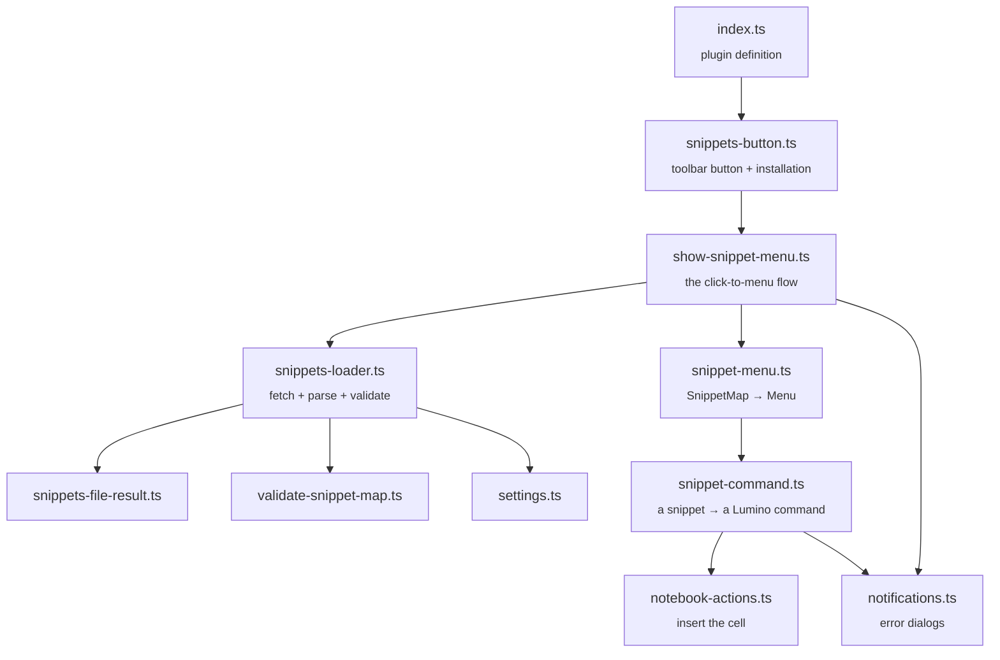

# jupyterlab-snippets

[](LICENSE)


**Stop retyping the same ten lines of pandas boilerplate.** jupyterlab-snippets adds a
**Snippets** button to every notebook toolbar. Click it, pick a snippet from your own
list, and it's inserted as a new cell below wherever you're working — no copy-pasting
from an old notebook, no scrolling through a personal wiki.

Your snippets live in a plain JSON file that you own and control — customize them to fit your workflow, check it into a repo, share it with a team.
## Features

- **One button, one file.** A "Snippets" button appears in every notebook toolbar and
  reads its contents from a single JSON file you point it at.
- **Insert, not replace.** The chosen snippet is added as a new code cell directly below
  the active cell and immediately selected, so you can keep typing.
- **Your file, your rules.** Snippets are just `{ "label": "code" }` pairs — edit them in
  any text editor, put them under version control, share them across a team.
- **Live reload.** The file is re-read every time you open the menu, so an edited snippet
  shows up on the very next click — no reload, no restart.
- **Clear failure messages.** A missing setting, a missing file, invalid JSON, or a
  malformed entry each produce a specific, readable dialog instead of a silent no-op.

## Requirements

- JupyterLab >= 4.0.0
- Python >= 3.10

## Install

```bash
pip install jupyterlab_snippets
```

## Quick start

1. **Write a snippets file** — anywhere within the directories accessible through JupyterLab's file browser, in the format described
   [below](#the-snippets-file). For example, `~/snippets.json`:

   ```json
   {
     "Import pandas": "import pandas as pd\n\ndf = pd.read_csv(\"data.csv\")",
     "Matplotlib setup": "import matplotlib.pyplot as plt\n\n%matplotlib inline\nplt.style.use(\"seaborn-v0_8\")",
     "Train/test split": "from sklearn.model_selection import train_test_split\n\nX_train, X_test, y_train, y_test = train_test_split(\n    X, y, test_size=0.2, random_state=42\n)"
   }
   ```

2. **Point the extension at it** — open JupyterLab's **Settings → Settings Editor**,
   find **jupyterlab-snippets**, and set **Custom snippets file path** to that file's
   path, relative to the directory your Jupyter server was started in (the same root the Jupyterlab file browser shows).

3. **Use it** — open any notebook, click **Snippets** in the toolbar, and pick an entry.
   It's inserted as a new cell right below your cursor.

That's it — no kernel restart, no server restart. Edit the JSON file and the next click
of the button reflects your changes.

## The snippets file

The file is a single flat JSON object. Each **key** becomes a menu label; each
**value** is the exact source inserted into the new cell.

```json
{
  "Label shown in the menu": "the code that gets inserted, \\n for new lines"
}
```

Rules the extension enforces, with the dialog you'll see if one is broken:

| Requirement                                                   | If it's violated                      |
| ------------------------------------------------------------- | ------------------------------------- |
| The setting must name a file                                  | _Snippets Error: no file configured_  |
| The file must exist and be reachable                          | _Snippets Error: file not found_      |
| The file's contents must be valid JSON                        | _Snippets Error: invalid JSON_        |
| The parsed JSON must be a flat object — no arrays, no nesting | _Snippets Error: could not read file_ |
| Every key must be a non-empty string, every value a string    | _Snippets Error: could not read file_ |

An empty object (`{}`) is valid and simply opens an empty menu. An empty _file_ opens the
menu with a _Snippets Error: no snippets available_ notice instead.

## Settings reference

| Key                    | Type     | Default | Description                                                                                                                                         |
| ---------------------- | -------- | ------- | --------------------------------------------------------------------------------------------------------------------------------------------------- |
| `custom_snippets_path` | `string` | `""`    | Path to the JSON file containing your snippets, relative to the directory the Jupyter server was started in — the same root the Jupyterlab file browser shows. |

Configurable from **Settings → Settings Editor → jupyterlab-snippets**

## How it's built

The codebase is organized into small, single-purpose modules with no circular dependencies:


A few things worth calling out for anyone reading the source:

- **Every notebook gets its own button instance** — a Lumino widget can only live in one
  parent, so the extension creates one per notebook rather than sharing a single button.
- **Every open menu owns a private Lumino `CommandRegistry`.** Snippet commands never
  touch the application's global command registry, so opening the menu repeatedly can't
  leak commands into it.
- **IO, validation, and presentation are cleanly separated.** `snippets-loader.ts` never
  shows a dialog; `notifications.ts` is the only place that knows what a dialog looks
  like. Read the failure, don't guess where it's reported from.
- **Strong typing throughout** — no `any`, `unknown` narrowed through type guards and
  assertion functions, and illegal states (like "both a result and an error") are
  unrepresentable in the types.

## Development

See [CONTRIBUTING.md](CONTRIBUTING.md) for a full local development setup (editable
install, watch mode, linting). In short:

```bash
pip install --editable "."
jupyter-builder develop . --overwrite
jlpm watch    # rebuilds on every save
jupyter lab   # in another terminal
```

## Uninstall

```bash
pip uninstall jupyterlab_snippets
```

## Contributing

Bug reports, feature requests, and pull requests are welcome — see
[CONTRIBUTING.md](CONTRIBUTING.md) to get set up, and [CHANGELOG.md](CHANGELOG.md) for
release history.

## License

[BSD-3-Clause](LICENSE)
